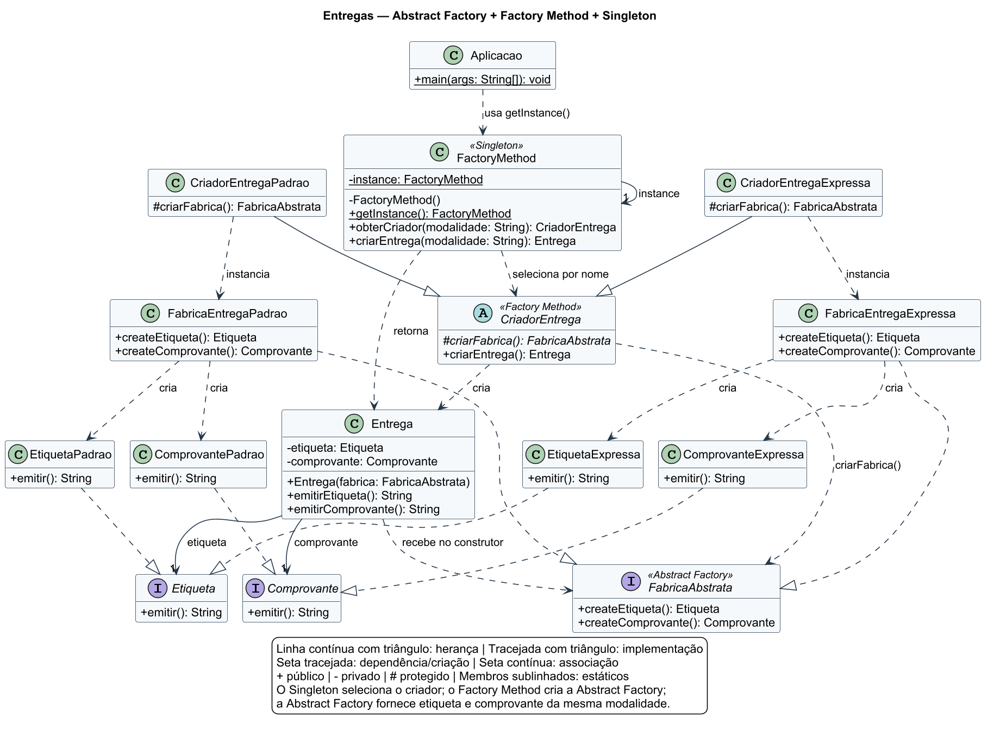

# Unificação dos padrões Abstract Factory, Factory Method e Singleton

Projeto desenvolvido para demonstrar a integração dos padrões de projeto **Abstract Factory**, **Factory Method** e **Singleton** em Java, como aplicação prática da disciplina Arquitetura e Projeto de Software.

O projeto simula a criação de entregas em duas modalidades: padrão e expressa. Cada entrega possui uma etiqueta e um comprovante correspondentes à modalidade escolhida.

O Abstract Factory cria famílias de produtos relacionados. O Factory Method permite que subclasses definam qual fábrica será utilizada. O Singleton disponibiliza uma única instância do ponto de seleção dos criadores.

## Funcionamento

A aplicação recebe a modalidade da entrega e cria os documentos correspondentes:

| Modalidade | Etiqueta | Comprovante |
| --- | --- | --- |
| `Padrao` | Etiqueta de entrega padrão | Comprovante de entrega padrão |
| `Expressa` | Etiqueta de entrega expressa | Comprovante de entrega expressa |

Quando nenhum argumento é informado, a aplicação utiliza `Padrao`. Os nomes são sensíveis a maiúsculas e minúsculas: utilize `Padrao`, sem acento, ou `Expressa`.

Os métodos `emitirEtiqueta()` e `emitirComprovante()` retornam textos. A implementação funciona em memória, sem gerar arquivos de documentos ou persistir dados em banco.

## Padrão Abstract Factory

O Abstract Factory é um padrão criacional que fornece uma interface para criar famílias de objetos relacionados sem exigir que o consumidor conheça suas classes concretas.

Neste projeto, a interface `FabricaAbstrata` define a criação dos dois produtos:

```java
public interface FabricaAbstrata {
    Etiqueta createEtiqueta();
    Comprovante createComprovante();
}
```

As fábricas concretas organizam as famílias:

| Fábrica | Produtos criados |
| --- | --- |
| `FabricaEntregaPadrao` | `EtiquetaPadrao` e `ComprovantePadrao` |
| `FabricaEntregaExpressa` | `EtiquetaExpressa` e `ComprovanteExpressa` |

As interfaces `Etiqueta` e `Comprovante` possuem o método `String emitir()`. Cada produto concreto implementa esse contrato com o texto de sua modalidade.

A classe `Entrega` recebe uma fábrica e mantém referências para os produtos por meio dessas interfaces:

```java
public Entrega(FabricaAbstrata fabrica) {
    Objects.requireNonNull(fabrica, "Fábrica obrigatória");
    this.etiqueta = Objects.requireNonNull(
            fabrica.createEtiqueta(), "Etiqueta obrigatória");
    this.comprovante = Objects.requireNonNull(
            fabrica.createComprovante(), "Comprovante obrigatório");
}
```

Assim, `Entrega` pode consumir outras implementações de `FabricaAbstrata`. As fábricas concretas fornecidas criam pares da mesma modalidade; uma fábrica personalizada é responsável pela compatibilidade de seus produtos.

## Padrão Factory Method

O Factory Method é um padrão criacional que define uma operação de criação e permite que subclasses escolham a implementação utilizada.

Neste projeto, o método de fábrica é `criarFabrica()`, declarado em `CriadorEntrega`:

```java
public abstract class CriadorEntrega {
    protected abstract FabricaAbstrata criarFabrica();

    public final Entrega criarEntrega() {
        return new Entrega(criarFabrica());
    }
}
```

As subclasses definem a família que será criada:

- `CriadorEntregaPadrao` retorna uma `FabricaEntregaPadrao`.
- `CriadorEntregaExpressa` retorna uma `FabricaEntregaExpressa`.

Por exemplo:

```java
public class CriadorEntregaExpressa extends CriadorEntrega {
    @Override
    protected FabricaAbstrata criarFabrica() {
        return new FabricaEntregaExpressa();
    }
}
```

O método público `criarEntrega()` reutiliza o fluxo de criação, enquanto cada subclasse decide qual fábrica fornecer.

## Padrão Singleton

O Singleton é um padrão criacional que mantém uma única instância de uma classe e fornece um ponto de acesso a ela.

A classe `FactoryMethod` implementa esse padrão com um construtor privado e uma instância estática criada na inicialização da classe:

```java
public final class FactoryMethod {
    private static final FactoryMethod instance = new FactoryMethod();

    private FactoryMethod() {
    }

    public static FactoryMethod getInstance() {
        return instance;
    }
    // Demais métodos de seleção e criação.
}
```

A instância compartilhada não mantém estado mutável. Cada chamada a `criarEntrega()` cria uma nova entrega, mesmo quando a modalidade é a mesma.

## Integração entre os padrões

O ponto de entrada para a criação é:

```java
Entrega entrega = FactoryMethod.getInstance().criarEntrega("Expressa");
```

O fluxo acontece da seguinte forma:

1. A aplicação acessa a instância Singleton de `FactoryMethod`.
2. `obterCriador()` localiza e instancia o criador correspondente à modalidade.
3. O criador executa `criarEntrega()`, que chama o Factory Method `criarFabrica()`.
4. A subclasse retorna a fábrica concreta da modalidade.
5. `Entrega` utiliza a Abstract Factory para criar sua etiqueta e seu comprovante.
6. A aplicação solicita a emissão dos textos dos produtos.

Apesar do nome da classe `FactoryMethod`, a operação que implementa o padrão por meio de subclasses é `CriadorEntrega.criarFabrica()`. A classe `FactoryMethod` concentra o acesso Singleton e a seleção dos criadores.

### Seleção por convenção de nomes

A seleção utiliza reflexão para procurar uma classe no pacote `padroescriacao.unificacao`, combinando o prefixo `CriadorEntrega` com a modalidade:

```text
Padrao   -> CriadorEntregaPadrao
Expressa -> CriadorEntregaExpressa
```

A modalidade deve corresponder à expressão `[A-Z][A-Za-z0-9]*`. O criador encontrado deve herdar de `CriadorEntrega` e possuir um construtor sem argumentos acessível ao seletor.

| Situação | Exceção | Mensagem |
| --- | --- | --- |
| Modalidade nula ou com formato inválido | `IllegalArgumentException` | `Modalidade inválida` |
| Classe do criador não encontrada | `IllegalArgumentException` | `Modalidade inexistente` |
| Classe encontrada não herda de `CriadorEntrega` | `IllegalArgumentException` | `Criador inválido` |
| Falha nas operações de reflexão tratadas pela implementação | `IllegalArgumentException` | `Não foi possível criar o criador` |

O construtor de `Entrega` também rejeita fábrica, etiqueta ou comprovante nulos com `NullPointerException`.

## Estrutura do projeto

```text
Unificar-padr-es-de-cria-o-Abstract-Factory-Factory-Method-Singleton/
├── docs/
│   └── diagrama-classes.png
├── src/
│   ├── main/java/padroescriacao/unificacao/
│   │   ├── Aplicacao.java
│   │   ├── Comprovante.java
│   │   ├── ComprovanteExpressa.java
│   │   ├── ComprovantePadrao.java
│   │   ├── CriadorEntrega.java
│   │   ├── CriadorEntregaExpressa.java
│   │   ├── CriadorEntregaPadrao.java
│   │   ├── Entrega.java
│   │   ├── Etiqueta.java
│   │   ├── EtiquetaExpressa.java
│   │   ├── EtiquetaPadrao.java
│   │   ├── FabricaAbstrata.java
│   │   ├── FabricaEntregaExpressa.java
│   │   ├── FabricaEntregaPadrao.java
│   │   └── FactoryMethod.java
│   └── test/java/padroescriacao/unificacao/
│       ├── CriadorEntregaInvalida.java
│       ├── CriadorEntregaSemConstrutor.java
│       ├── CriadorEntregaTest.java
│       ├── EntregaTest.java
│       ├── FabricaAbstrataTest.java
│       └── FactoryMethodTest.java
├── .gitignore
├── pom.xml
└── README.md
```

## Como executar

### Pré-requisitos

- JDK 11 ou superior.
- Maven instalado e disponível no terminal.
- Git, caso utilize o comando de clonagem abaixo.

Clone o repositório e entre na pasta do projeto:

```bash
git clone https://github.com/lipebaba/Unificar-padr-es-de-cria-o-Abstract-Factory-Factory-Method-Singleton.git
cd Unificar-padr-es-de-cria-o-Abstract-Factory-Factory-Method-Singleton
```

Compile o projeto:

```bash
mvn compile
```

Execute a aplicação com a modalidade padrão:

```bash
java -cp target/classes padroescriacao.unificacao.Aplicacao
```

Saída esperada:

```text
Etiqueta de entrega padrão
Comprovante de entrega padrão
```

Para a modalidade expressa:

```bash
java -cp target/classes padroescriacao.unificacao.Aplicacao Expressa
```

Saída esperada:

```text
Etiqueta de entrega expressa
Comprovante de entrega expressa
```

## Exemplo de utilização

```java
FactoryMethod factory = FactoryMethod.getInstance();

Entrega padrao = factory.criarEntrega("Padrao");
Entrega expressa = factory.criarEntrega("Expressa");

System.out.println(padrao.emitirEtiqueta());
System.out.println(padrao.emitirComprovante());
System.out.println(expressa.emitirEtiqueta());
System.out.println(expressa.emitirComprovante());
```

Também é possível utilizar um criador diretamente:

```java
Entrega entrega = new CriadorEntregaExpressa().criarEntrega();
```

Ou fornecer uma fábrica ao construtor de `Entrega`:

```java
Entrega entrega = new Entrega(new FabricaEntregaPadrao());
```

## Testes automatizados

O projeto utiliza **JUnit 5.11.4** e possui **19 métodos de teste**, distribuídos entre quatro classes:

| Classe | Quantidade | Verificações |
| --- | --- | --- |
| `CriadorEntregaTest` | 1 | Delegação para o método de fábrica sobrescrito pela subclasse |
| `EntregaTest` | 6 | Emissão dos produtos, consumo de uma fábrica personalizada e rejeição de fábrica nula |
| `FabricaAbstrataTest` | 2 | Tipos dos produtos das famílias padrão e expressa |
| `FactoryMethodTest` | 10 | Singleton, integração dos padrões, seleção dos criadores, entregas distintas, entradas inválidas e concorrência |

O teste de concorrência executa 100 tarefas em um pool de oito threads, verificando o compartilhamento do Singleton e a correspondência dos produtos com a modalidade solicitada.

As classes `CriadorEntregaInvalida` e `CriadorEntregaSemConstrutor` são auxiliares dos testes dos caminhos de erro da seleção por reflexão.

Para executar os testes:

```bash
mvn test
```

## Diagrama de classes

O diagrama de classes está disponível na pasta `docs`:



## Tecnologias utilizadas

- Java 11.
- Maven.
- JUnit 5.11.4.
- Maven Compiler Plugin 3.13.0.
- Maven Surefire Plugin 3.5.2.
- Padrões de projeto criacionais Abstract Factory, Factory Method e Singleton.
- Reflexão para seleção dos criadores por convenção de nomes.

## Objetivo acadêmico

Demonstrar como três padrões criacionais podem colaborar em uma mesma solução: o Abstract Factory organiza as famílias de produtos, o Factory Method permite que subclasses escolham a fábrica e o Singleton centraliza o acesso ao seletor de criadores.

Para adicionar uma modalidade, podem ser implementados novos produtos, uma fábrica concreta e uma subclasse de `CriadorEntrega`. Seguindo a convenção de nomes e os requisitos do construtor, o seletor existente consegue localizar o novo criador sem adicionar uma condição para a modalidade.

## Autor

Felipe Baba

Projeto desenvolvido para fins acadêmicos na disciplina Arquitetura e Projeto de Software.
